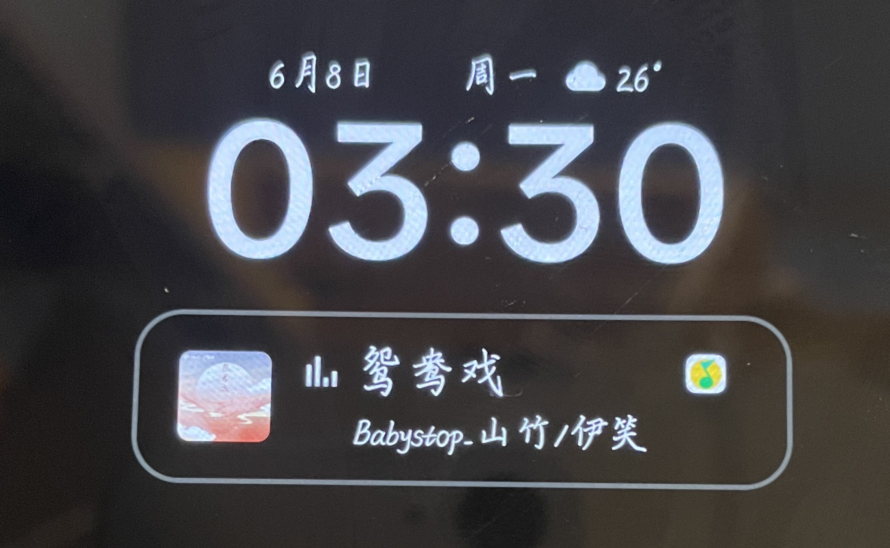
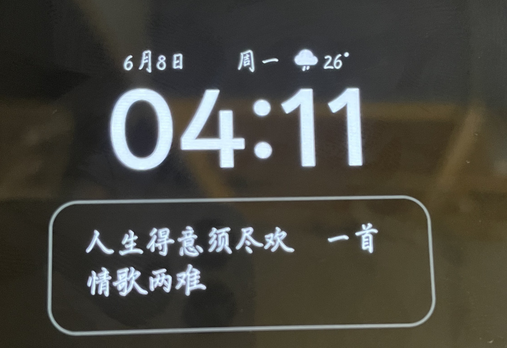

# ColorOS AOD Lyrics

把 ColorOS 息屏显示里的音乐卡片改成极简实时歌词显示。

## 效果对比

| 原息屏音乐卡片 | 息屏歌词样式 |
| --- | --- |
|  |  |

## v0.2.2-safe 设备专用一键包

# ⚠️ 只确认适用于下面这个版本，其他版本不要刷入这个 ZIP

这个版本包含一个 Magisk / KernelSU / APatch 一键刷入包：

`ColorOSAodLyrics-SystemUI-MagiskModule-device-v0.2.2-safe.zip`

它会先让官方 SystemUI 正常启动，等系统进桌面并完成启动后，再延迟挂载实机调试成功的 `SystemUI.apk` 补丁，用来让当前设备重启后仍然保持息屏歌词效果。

v0.2.0 的 ZIP 由 Windows 打包，目录分隔符在手机上被识别成反斜杠文件名，导致 Magisk 无法按目录覆盖。v0.2.1 虽修复目录结构，但开机早期处理 SystemUI 仍然偏激进。v0.2.2-safe 改成延迟挂载，是当前推荐版本。

已验证设备信息：

| 项目 | 值 |
| --- | --- |
| 品牌 | OPPO |
| 机型 | PME110 |
| 设备代号 | OP61C1L1 |
| 系统显示版本 | PME110_16.0.7.202(CN01) |
| Android 版本 | 16 / SDK 36 |
| OPlus ROM | V16.1.0 |
| 安全补丁 | 2026-04-01 |
| SystemUI 包名 | com.android.systemui |
| SystemUI versionName | 16.99.12 |
| SystemUI versionCode | 169912 |
| SystemUI APK SHA256 | 50049b655f1c35c534d5d1814358c714a50145b7bb3f36216bd96bc89fcc36e1 |
| 一键包 SHA256 | 458b9a6918470265b6582a7239eceb839debadd7e067ca7e46fbebbed15c3ab7 |

如果你的机型、系统版本、SystemUI 版本任意一项不同，请不要刷 v0.2.2-safe 的一键包。请看 v0.1.0 的 LSPosed 原型和源码，自行适配、编译、测试。

## v0.2.2-safe 一键包实现效果

- 息屏音乐卡片显示实时歌词。
- 歌词可以随播放进度自动刷新。
- 隐藏专辑图、QQ 音乐图标、小频谱图标、引导图标、歌手行。
- 保留最多 2 行歌词显示。
- 使用 3 行高度避免两行歌词上沿被裁切。
- 不依赖 LSPosed。
- 不需要安装本仓库的 LSPosed APK。

## 启动时的正常现象

刷入 v0.2.2-safe 后，手机进系统约 20 多秒时会黑屏/闪屏一次，这是模块在系统启动完成后主动重启 SystemUI，用来从官方界面切换到歌词补丁界面。只要之后能正常进入桌面、锁屏和息屏显示，这不是设备故障。

## 歌词测试环境

当前实机验证的歌词来源环境是 QQ 音乐 14.11.0.8 旧版 + 词幕 1.3.3。更高版本 QQ 音乐和其他音乐 App 暂未测试，可能需要其他玩家继续验证或适配。

## v0.2.2-safe 使用方法

1. 确认你的设备信息和上表完全一致。
2. 下载 `ColorOSAodLyrics-SystemUI-MagiskModule-device-v0.2.2-safe.zip`。
3. 在 Magisk / KernelSU / APatch 里刷入这个 ZIP。
4. 重启手机。
5. 播放音乐，进入息屏显示。

如果刷入后 SystemUI 异常、黑屏或无法正常解锁，请从 Recovery、模块管理器安全模式，或 `/data/adb/modules` 删除模块。

## v0.1.0 通用原型

v0.1.0 是 LSPosed 模块原型，适合其他 ColorOS 玩家研究和自行适配：

1. 安装 `ColorOSAodLyrics-lsposed-debug.apk`。
2. 在 LSPosed 启用模块。
3. 作用域选择 `系统界面` / `com.android.systemui`。
4. 重启 SystemUI 或重启手机。

注意：v0.1.0 不是保证可用的成品，只是通用方向的原型。不同 ColorOS 版本的 AOD 类名、资源 ID、布局结构可能不同，需要二次适配。

## 项目文件

- `app/src/main/java/com/codex/colorosaodlyrics/HookEntry.java`：LSPosed 原型入口。
- `docs/IMPLEMENTATION.md`：实现思路。
- `docs/DEVICE_PATCH_NOTES.md`：v0.2.0 实机补丁记录。
- `docs/BUILD_AND_TEST.md`：构建和测试说明。

## 致谢

这个原型由 Codex 和实机调试共同整理。欢迎其他 ColorOS 玩家继续改进、适配更多机型。
